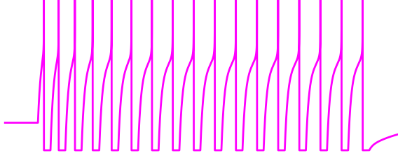

 

  

# adex

Exploring the Adaptive Exponential Integrate-and-Fire neuronal model.

## Acknowledgments

Many thanks to Nassi Papoutsi and Spyros Chavlis (https://dendrites.gr/) whose ["Principles of Computational Modeling in Neural Circuits" course material](https://github.com/spirosChv/neuro208) formed the basis for this project.

## References

1. **Brette, R., & Gerstner, W.** (2005). Adaptive exponential integrate-and-fire model as an effective description of neuronal activity. Journal of neurophysiology, 94(5), 3637-3642. doi: [10.1152/jn.00686.2005](https://doi.org/10.1152/jn.00686.2005)
2. [Brian example: Brette Gerstner 2005](https://brian2.readthedocs.io/en/stable/examples/frompapers.Brette_Gerstner_2005.html)
